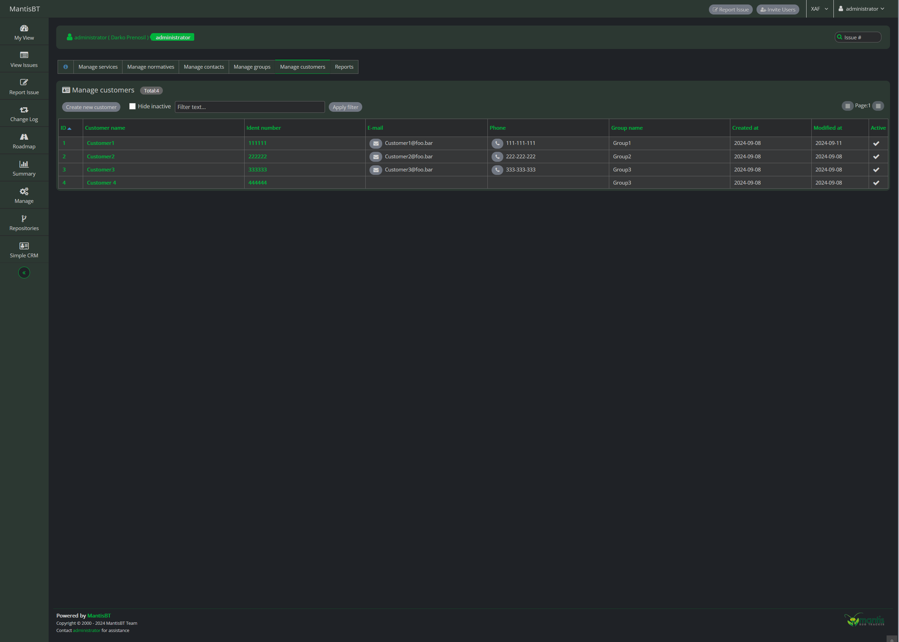

# MantisBT SCrm Plugin

Simple CRM for MantisBT

## Requirements

The Simple CRM plugin requires **[MantisBT](https://mantisbt.org/)** version 2.0 or higher.

### Setup Instructions

1. Download the SCrm plugin.

2. Copy the plugin (the `SCrm/` directory) into your Mantis installation's `plugins/` directory.

3. While logged into your Mantis installation as an administrator, go to 'Manage' -> 'Manage Plugins'.

4. In the "Available Plugins" list, find the "Simple CRM" plugin:

    a. Click the "Install" link for the "Simple CRM" plugin.

5. Once installed, click on "Simple CRM" in the main menu to configure it.

### Notes
The plugin started as an attempt to upgrade the existing plugin:
[Customer Management Plugin](https://github.com/mantisbt-plugins/customer-management) to be compatible with MantisBT 2.0. However, it evolved into something completely different.
I used the existing plugin as a "learning ground", but in the end did not use any of existing code.
Key changes include:
- Removal of dependencies (like jQueryUI) to ensure the plugin better integrates with the MantisBT UI.
- Workflow changes to suit our specific needs.

The plugin has only been tested with a PostgreSQL database and has not been tested with MySQL.

Additionally, the plugin includes its own dark theme, which can be enabled in user preferences.

## How It Works

### Configuration
Once installed, the plugin adds a menu item to the main Mantis menu. The administrator can then configure the plugin:

### Services
Users can define services with fields for "points per hour" and "billable status" by default.

### Normatives
Users can define "Normatives" for services that differ from the default settings. For instance, users can create separate normatives for customers paying a monthly fee.

A "Normative" can include one or more services. If a service is not listed, the default service values will be used.

### Contacts
Users can manage a list of contacts, including emails, phone numbers, and other details.

### Groups
Users can manage customer groups, which can be used later for filtering issues.

### Customers
Users can manage a list of customers with details like emails and phone numbers.

Each customer must belong to a group and can be linked with contacts. If the customer has a defined normative, the service data will be pulled from that normative. If no normative is defined, default service data will be used.

Each customer also has "Vault items." All data stored in the vault is encrypted in the database. The encryption key used is `$g_crypto_master_salt` from the config file. If you change this key, you will not be able to decrypt data stored in the database.

At the bottom of the "Customer" form, there is a list of issues related to that customer:

### Issues (Bugs)
When opening or editing an issue, users can (or must, depending on configuration) assign the issue to a customer:

### Activities (Notes)
When adding or editing an activity (note), users can (or must, depending on configuration) enter the customer contact, service, and time duration:

After saving the activity, users can view calculated data about time spent and points per hour for each activity and for the entire issue:

### Reports
Users can generate reports on time spent, billable hours, and billable points using the standard Mantis filter:

### Create issue from email
Users can import e-mails from one "support email account". Custoers are autoatically recognized by customer or contact email. All attachements are also created and connected with issue.:

